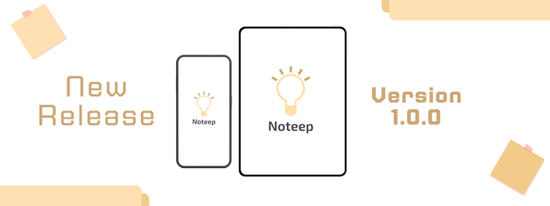

## 🔶 Authors
- [@ndn21](https://github.com/ndenicolais)

## 📄 Description

This application allows you to create a digital notebook of your own notes. You can organize notes visually and set notifications to remind you of important events. It’s ideal for anyone who wants to keep their notes well organized and easily accessible.

## 💎 Release

App release 1.0.0 is available for download. You can download it from the following link:

[Download v1.0.0](https://github.com/ndenicolais/Noteep/releases/download/v1.0.0/Noteep_v1.0.0.apk)

## 🔑 Features
- Login via Google or email & password
- Data storage with Firestore Database
- Responsive design for all screens with ScreenUtil
- Navigation with transition effects with Get
- Light and dark theme variants
- English and Italian languages variants
- Customizable colors and fonts
- Notifications for each note synced across multiple devices

## 🎨 Screenshots

## 📌 Packages
Below is a list of some of the most relevant packages:
- [get](https://pub.dev/packages/get)
- [flutter_screenutil](https://pub.dev/packages/flutter_screenutil)
- [google_fonts](https://pub.dev/packages/google_fonts)
- [cloud_firestore](https://pub.dev/packages/cloud_firestore)
- [intl](https://pub.dev/packages/intl)
- [provider](https://pub.dev/packages/provider)
- [shared_preferences](https://pub.dev/packages/shared_preferences)
- [flutter_local_notifications](https://pub.dev/packages/flutter_local_notifications)
